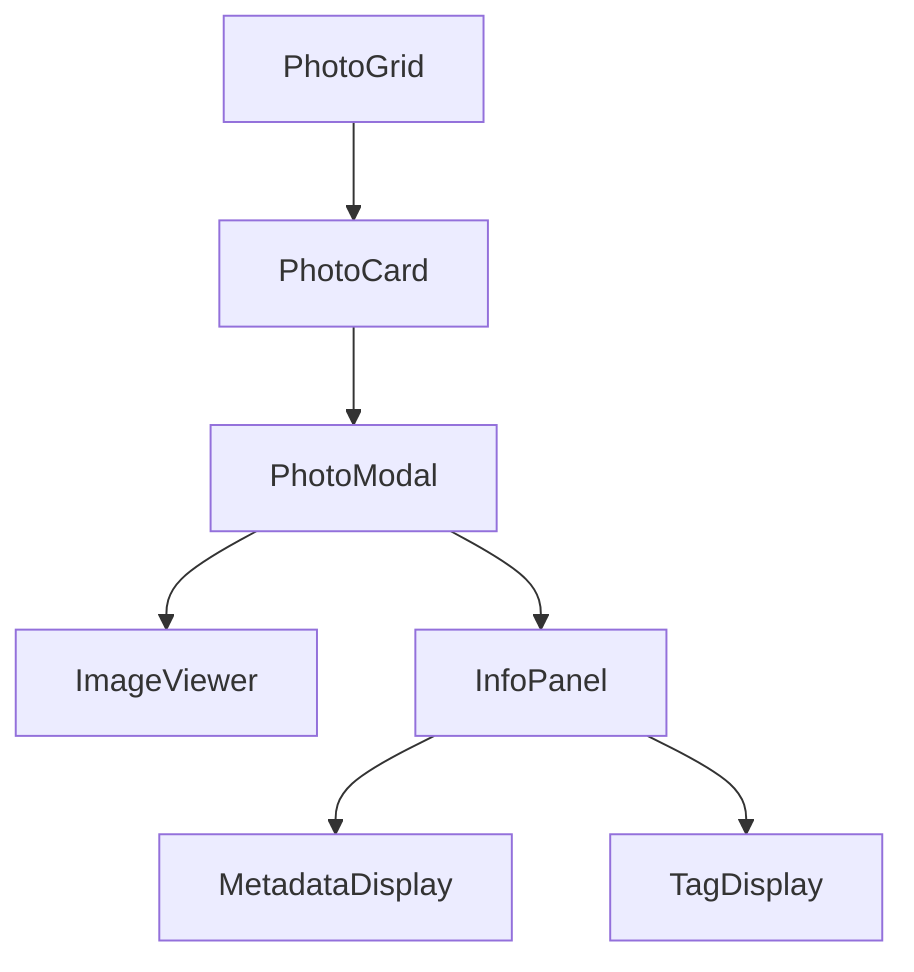
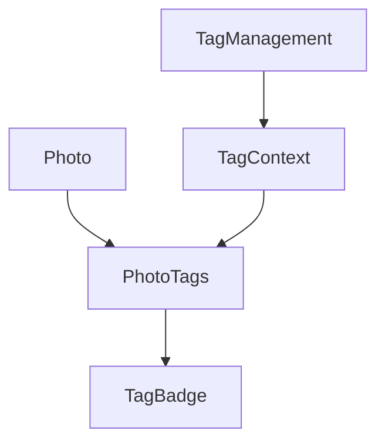
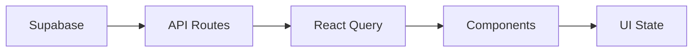
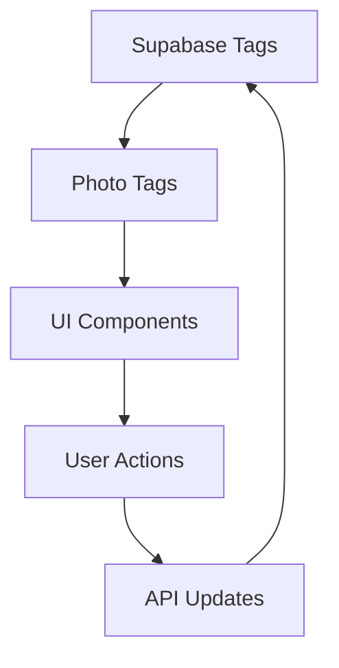

# System Patterns

## Component Architecture

### Modal System
- Using Radix UI for accessible modal dialogs
- Custom dialog wrapper for consistent styling
- Centralized modal state management
- Keyboard navigation support
- Focus management patterns

### Photo Viewing


### Tag System


## Data Flow

### Photo Data


### Tag Management


## State Management
- React Query for server state
- Local state for UI interactions
- Context for shared state
- Optimistic updates for better UX

## Error Handling
- Boundary pattern for component errors
- API error handling with proper feedback
- Type-safe error handling
- Graceful degradation

## Performance Patterns
- Image optimization
- Lazy loading
- Virtualization for large lists
- Proper caching strategies

## Accessibility Patterns
- ARIA labels and roles
- Keyboard navigation
- Focus management
- Screen reader support

## Testing Strategy
- Component testing with Cypress
- Unit tests with Vitest
- Integration tests for critical paths
- E2E testing for user flows

## Code Organization
```
src/
  components/
    features/
      photo/
        PhotoModal.tsx
        PhotoGrid.tsx
    ui/
      Dialog.tsx
      Badge.tsx
  types/
    index.ts
    database.ts
  lib/
    api/
    utils.ts
```

## Best Practices
- Type safety throughout
- Component composition
- Single responsibility
- DRY principles
- Progressive enhancement
